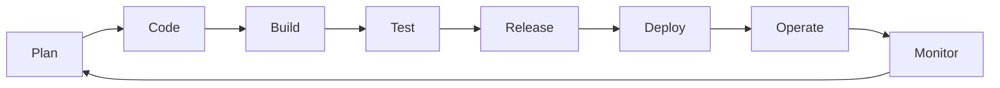

# 00 - Introdução ao DevOps

Esta pasta tem como objetivo apresentar os **conceitos fundamentais de DevOps**, sua cultura, ciclo e práticas essenciais.

---

## 🎯 O que é DevOps

DevOps é uma combinação de **cultura, práticas e ferramentas** que aumenta a capacidade de uma organização em **entregar aplicações e serviços de forma rápida e confiável**. 

O foco é **integração entre desenvolvimento (Dev) e operações (Ops)** para acelerar o ciclo de vida do software.

### Benefícios do DevOps
- Redução do tempo de entrega de software  
- Maior qualidade e estabilidade das aplicações  
- Colaboração mais próxima entre equipes de Dev e Ops  
- Automação de processos repetitivos e manuais  

---

## 🌱 Cultura DevOps

- **Colaboração**: Dev e Ops trabalhando juntos desde o planejamento até a produção  
- **Automação**: Reduzir tarefas manuais e repetitivas  
- **Feedback contínuo**: Monitoramento constante para melhoria contínua  
- **Responsabilidade compartilhada**: Qualidade e estabilidade são de todos  

---

## 🔄 Ciclo DevOps (CI/CD)

O ciclo DevOps é contínuo e iterativo. Ele pode ser resumido em:

- **Plan**: Planejamento de features, backlog, requisitos
- **Code**: Desenvolvimento de software, controle de versão
- **Build**: Compilação, geração de artefatos
- **Test**: Testes unitários, integração, qualidade de código
- **Release**: Preparação para deploy em ambientes
- **Deploy**: Entrega em produção ou staging
- **Operate**: Operação e manutenção do software
- **Monitor**: Observabilidade, métricas, logs e feedback

---

## ⚙️ Práticas essenciais

- **Controle de versão**: Git, GitHub, GitLab
- **Integração contínua (CI)**: Automação de builds e testes
- **Entrega contínua (CD)**: Deploy automático em ambientes de teste/prod
- **Containers**: Docker, Podman
- **Orquestração**: Kubernetes, Helm
- **Infraestrutura como código (IaC)**: Terraform, Ansible
- **Monitoramento e observabilidade**: Prometheus, Grafana, Loki
- **Segurança integrada (DevSecOps)**: Scanners de vulnerabilidade, boas práticas de segurança

---

## 💡 Dicas de estudo

- Sempre tente praticar os conceitos em laboratório (Docker, Minikube, VMs locais)
- Use o Git para versionar tudo que você fizer
- Explore diagramas e fluxos para entender o ciclo DevOps
- Leia sobre cultura DevOps e cases de sucesso